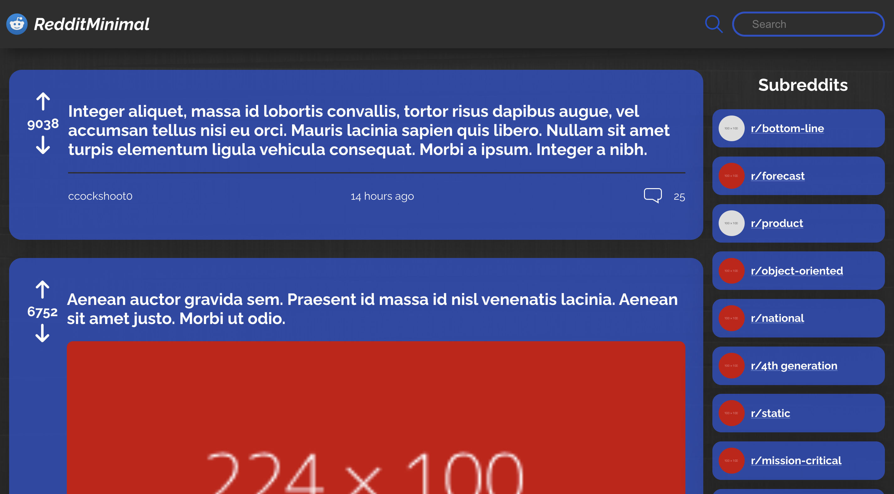

<div align="center">

# 📘 Reddit Client

## **A Reddit clone that simplifies the Reddit experience. This is also Codecademy Portfolio Project.**



</div>

## 🥇 Features

- Users can use the application on any device (desktop to mobile)
- Users can use the application on any modern browser
- Users can access your application at a URL
- Users see an initial view of the data when first visiting the app
- Users can search the data using terms
- Users can filter the data based on categories that are predefined
- Users are shown a detailed view (modal or new page/route) when they select an item
- Users are delighted with a cohesive design system
- Users are delighted with animations and transitions
- Users are able to leave an error state

## 🔨 How to use/view

- In the project directory, you can use ```npm start``` to run the app in the development mode.  
Open <http://localhost:3000> to view it in the browser.

- Website currently not live. Expect a working version to come out soon!

## 💻 Technologies

- React.js
- Redux
- HTML
- CSS
- Reddit API
- Jest and Enzyme

## 🧑‍💻 Team

- [@Hmcg23](https://github.com/Hmcg23)
- Just a solo project so far, but looking for other to collaborate! Dm me on [discord](https://discord.com) @ hud*#7135.

## 📄 Licence

MIT License

Copyright (c) 2022 Hmcg23

Permission is hereby granted, free of charge, to any person obtaining a copy
of this software and associated documentation files (the "Software"), to deal
in the Software without restriction, including without limitation the rights
to use, copy, modify, merge, publish, distribute, sublicense, and/or sell
copies of the Software, and to permit persons to whom the Software is
furnished to do so, subject to the following conditions:

The above copyright notice and this permission notice shall be included in all
copies or substantial portions of the Software.

THE SOFTWARE IS PROVIDED "AS IS", WITHOUT WARRANTY OF ANY KIND, EXPRESS OR
IMPLIED, INCLUDING BUT NOT LIMITED TO THE WARRANTIES OF MERCHANTABILITY,
FITNESS FOR A PARTICULAR PURPOSE AND NONINFRINGEMENT. IN NO EVENT SHALL THE
AUTHORS OR COPYRIGHT HOLDERS BE LIABLE FOR ANY CLAIM, DAMAGES OR OTHER
LIABILITY, WHETHER IN AN ACTION OF CONTRACT, TORT OR OTHERWISE, ARISING FROM,
OUT OF OR IN CONNECTION WITH THE SOFTWARE OR THE USE OR OTHER DEALINGS IN THE
SOFTWARE.
